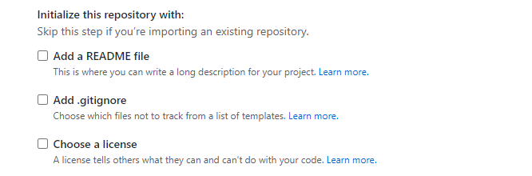

# hacktoberfest-how-to-use-git
Mari berkontribusi membuat tutorial cara menggunakan GIT dengan bahasa Indonesia.

## Daftar isi:

- [Instalasi Git](#instalasi)
- [Konfigurasi Git](#konfigurasi)
- [Membuat repository](#membuat-repository)
- [Cloning repository](#cloning-repository)
- [Membuat branch](#membuat-branch)
- [Push repository](#push-repository)

## Instalasi

- #### Debian/Ubuntu
    - Untuk versi stabil terbaru rilis Debian / Ubuntu
        Buka terminal window, masukkan perintah
        `sudo apt-get install git`
    - Untuk Ubuntu, PPA ini menyediakan versi stabil upstream Git terbaru
        `sudo add-apt-repository ppa:git-core/ppa` 
        `sudo apt update; sudo apt install git`

## Konfigurasi
    - Ada beberapa konfigurasi yang harus dupersiapakan sebelum mulai menggunakan Git, seperti name dan email. 
    - Silahkan lakukan konfigurasi dengan perintah berikut ini. 
        git config --global user.name "Nama Kamu"
        git config --global user.email contoh@emailmu.com
    
    - Kemudian periksa konfigurasinya dengan perintah:
        git config --list

## Membuat repository
    - Buka github kamu untuk membuat repository, lalu klik tanda + di sisi atas kanan github kamu, lalu pilih New Repository

    - Tulis nama repository yang kalian inginkan, contoh: hello-world

    - Untuk opsional bisa menuliskan deskripsi repository kalian, sebagai keterangan repository.

    - Lalu pilih tipe repository kalian, apakah digunakan untuk diri sendiri atau umum. Repository private hanya bisa diakses oleh kamu saja, Repository public bisa diakses oleh siapa aja dan dapat di pull request oleh siapa aja yang ingin berkontribusi dalam pengembangan repository tersebut.

    - Pilih initialize this repository with. 
    1. "Add a README FILE" berguna untuk menambahkan file readme pada repository kalian. 
    2. "Add .gitignore" berguna untuk menambahkan file .gitignore pada repository kalian.
    Jika kalian sudah punya repository local maka UNCHECKLIST pada bagian ini.

    - Akhiri dengan klik "Create Repository"

## Cloning repository
    - Buka GitHub kalian, dan buka repository yang sudah kalian buat sebelumnya, pada studi kasus ini menggunakan HTTPS

    
    - buka terminal kalian, dan letakkan repository pada folder lokal kalian, lalu ketikkan "git clone <link repository kalian> <nama repository>"

    kamu sudah berhasil clone repository kosongmu dari github

## Membuat branch
    

## Push repository
